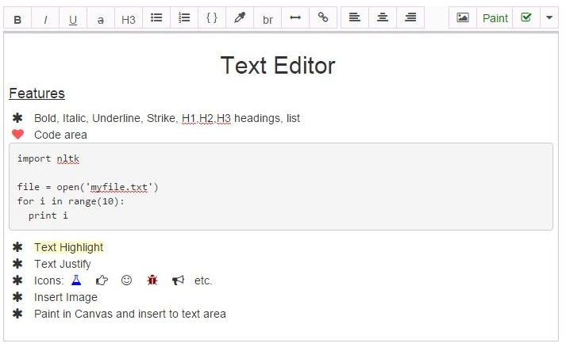

# Angular Rich Text Editor
A rich text editor directive plugin in angularjs

demo: (http://cslab.org/texteditor)

Note: The contenteditable text field is not two way bound.
For more versatile text editor in angular see (http://textangular.com/)

